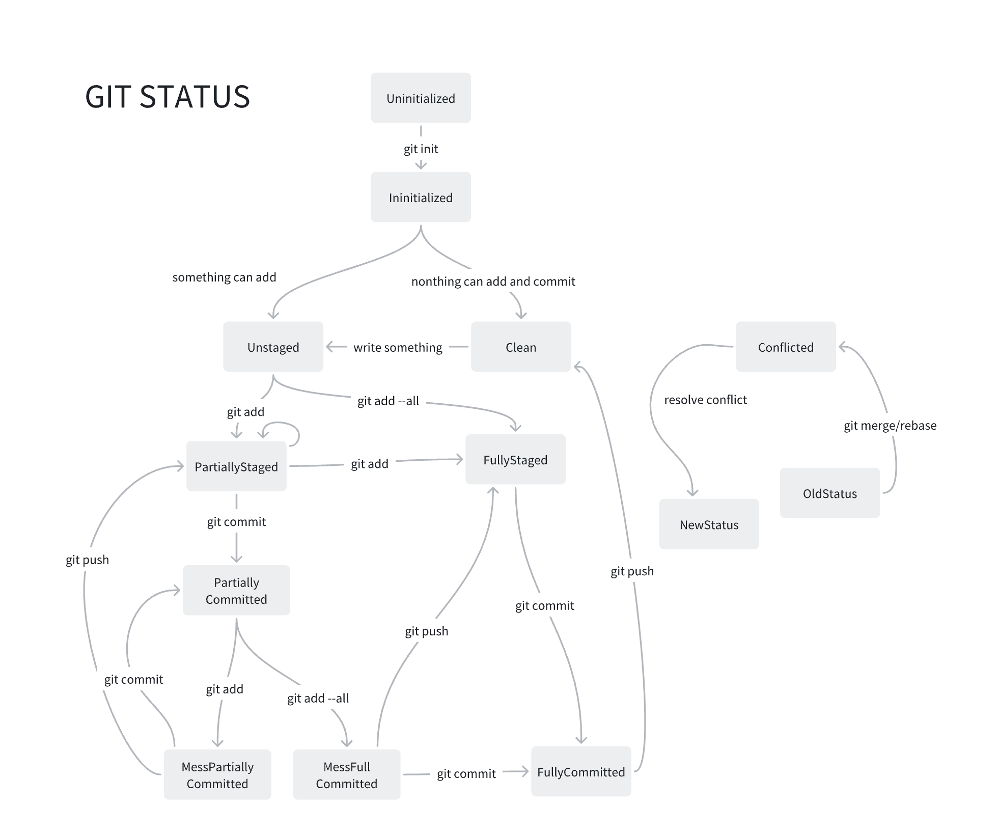
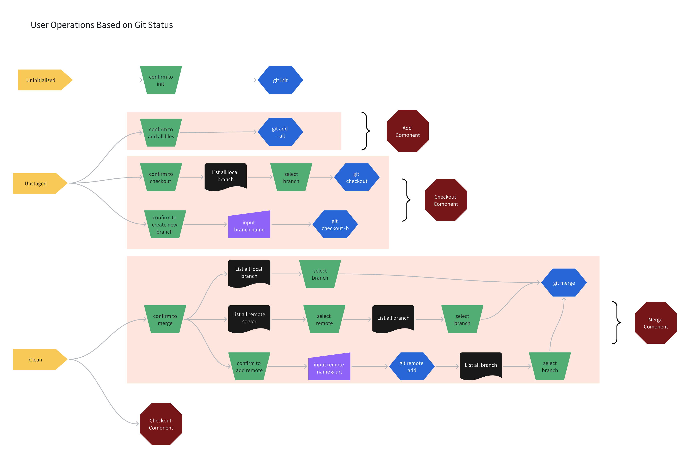
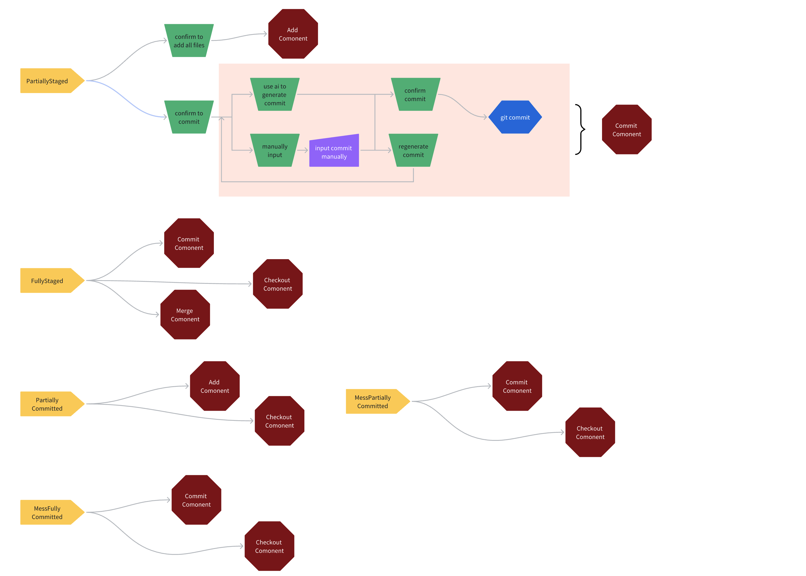
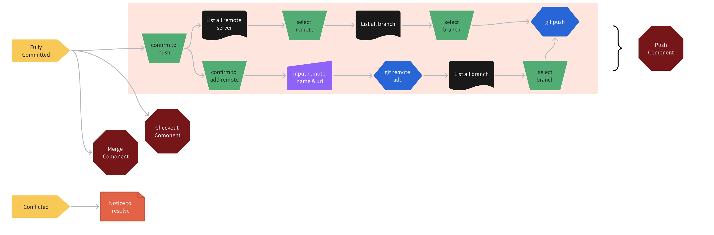

# Git Flow

A tool to help users utilize git based on the current git status.

## Status

The tool identifies the following statuses:

1. **Uninitialized**: The directory has not been initialized with `git init`.
2. **Initialized**: The directory has been initialized with `git init` but does not have any commits yet.

3. **Clean**: There are no uncommitted changes in the working directory or staging area. No changes can be added or committed.

4. **Unstaged**: Changes are present that can be added to the staging area. Nothing can be committed or pushed.

5. **PartiallyStaged**: Some changes in the working directory have been staged, while others have not. Some changes have been added with `git add`, but not all, and they are ready to be committed.

6. **FullyStaged**: There are no uncommitted changes in the working directory, but there are changes that have been staged. Changes have been made and staged with `git add`, but have not been committed yet.

7. **PartiallyCommitted**: Some changes have been committed, while no changes remain uncommitted in the staging area. Files can still be added to the stage with `git add`.

8. **MessPartiallyCommitted**: Some changes have been committed, while other changes remain uncommitted in the working directory or staging area. Changes can be committed with `git commit` or pushed with `git push`.

9. **MessFullyCommitted**: All changes from the staging area have been committed, while other changes remain uncommitted in the working directory.

10. **FullyCommitted**: All changes from the staging area and working directory have been committed.

11. **Conflicted**: Conflicts have arisen after a `merge` or `rebase`.

## Flows

